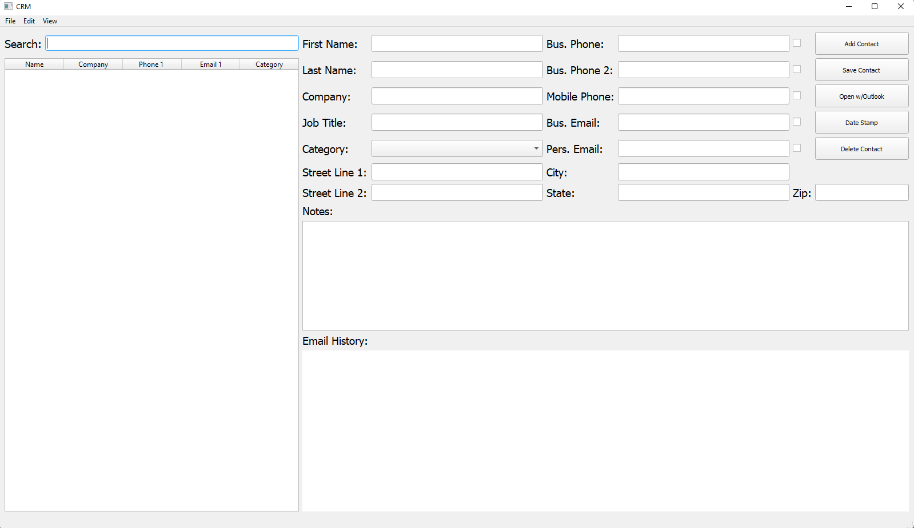

# CRM (Client Relations Management)

## About 

#### Open source CRM client project I did a few years back. It allows the user to keep track of their clients and also displays the last outlook email between the user and client. In retrospect, this project is awful. The email functionality is implemented in pywin32 and at he time I had no idea that the Outlook API existed. The database implementation could be significantly improved as well. All in all I'm glad I did it and at the time it was a huge learning expirience for me.

#### This might serve as a framework or starting point looking to build something similar (and better)

#### Currently, this is only working on Windows since it uses pywin32. Should work with Python 3.8+. 

## Installation 
* #### ``` git clone https://github.com/JustinTheWhale/CRM.git ```
* #### ``` cd CRM ```
* #### ``` pip install -r requirements.txt ```
* #### ``` python CRM.py ```


## Example
